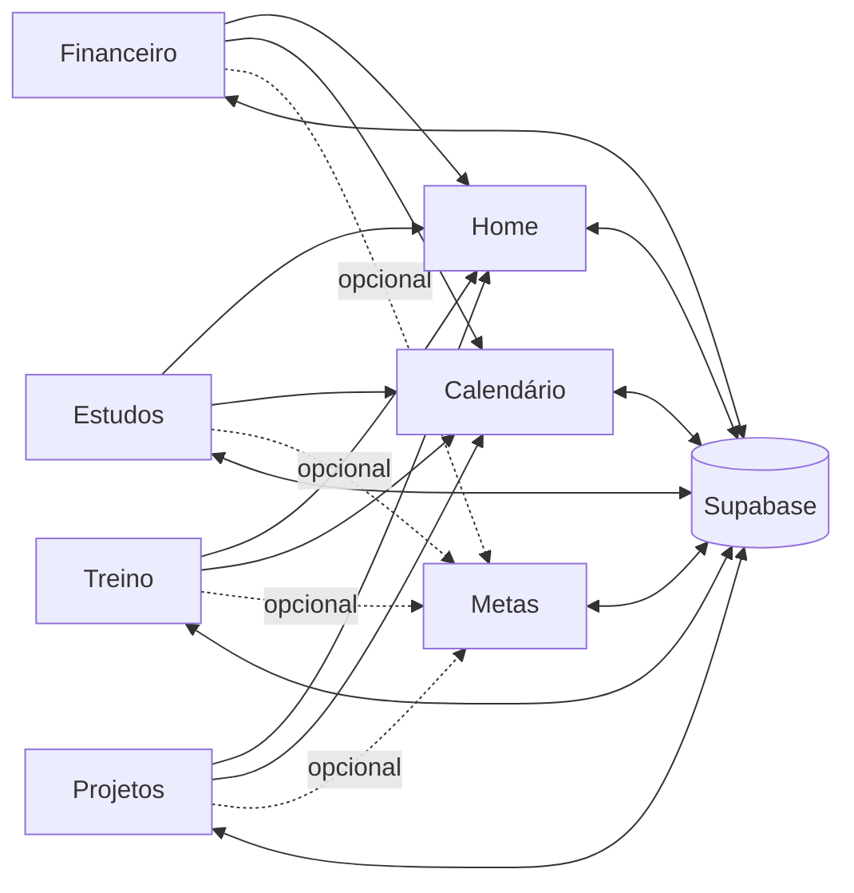

# Nexus

**Sistema de gestão pessoal de um usuário só** — sem login, sem multi-tenant,
feito pra rodar no bolso. Quatro pilares, uma Home que resume tudo, um
Calendário que amarra os quatro.


> O plano de execução completo está em [`plano.md`](./plano.md). A **seção
> 10** registra cada decisão tomada em uso, na ordem em que aconteceu, e
> **sobrescreve** as seções anteriores onde houver conflito — é a fonte de
> verdade final do escopo.

---

## Os pilares, de relance

| Pilar | Rota | Responde a... |
| --- | --- | --- |
| **Home** | `/` | "o que preciso ver hoje, de todos os pilares?" |
| **Financeiro** | `/financeiro` | "quanto posso gastar, e em quê?" |
| **Estudos** | `/estudos` | "vou passar? tenho aula hoje?" |
| **Treino** | `/treino` | "o que treino hoje, e estou evoluindo?" |
| **Projetos** | `/projetos` | "o que está parado, e o que está ativo?" |
| **Calendário** | `/calendario` | "o que vem, e onde a semana aperta?" |
| **Metas** | *(seção na Home)* | "o que estou perseguindo, de qualquer pilar?" |

---

## Índice

- [Arquitetura](#arquitetura)
- [Stack](#stack)
- [Como rodar](#como-rodar)
- [Tour pelos pilares](#tour-pelos-pilares)
- [Padrões compartilhados de UI](#padrões-compartilhados-de-ui)
- [Convenções de código](#convenções-de-código)
- [PWA](#pwa)
- [Notificações push](#notificações-push)
- [Deploy (Vercel)](#deploy-vercel)
- [Segurança](#segurança)

---

## Arquitetura

Os 4 pilares são donos dos próprios dados. A Home e o Calendário **agregam**
sem duplicar tabela nenhuma — cada um lê as fontes originais e traduz para a
própria necessidade (resumo na Home, evento no Calendário). Metas é a exceção
transversal: um dado próprio, com vínculo **opcional** a um pilar por vez.



### Estrutura de pastas

```
.
├── plano.md              # Plano de execução (fonte de verdade do escopo)
└── app/
    ├── src/
    │   ├── components/
    │   │   ├── layout/   # AppShell, Sidebar, ThemeToggle
    │   │   └── ui/       # shadcn/ui (vendored)
    │   ├── features/     # um módulo por pilar: api, hooks, calculos, componentes
    │   │   └── financeiro/
    │   ├── hooks/
    │   ├── lib/          # supabase, queryClient, pilares, constants, datas
    │   ├── pages/        # uma pasta por pilar (rotas)
    │   ├── stores/       # Zustand
    │   └── types/        # database.ts (gerado)
    └── supabase/
        └── migrations/   # schema versionado (resolução 10.11)
```

---

## Stack

| Camada | Tecnologia |
| --- | --- |
| Build | Vite 8 + React 19 + TypeScript (estrito) |
| Estilo | Tailwind CSS v4 + shadcn/ui |
| Estado servidor | TanStack React Query |
| Estado UI | Zustand (tema, sidebar) |
| Gráficos | Recharts |
| Calendário | FullCalendar |
| Formulários | React Hook Form + Zod |
| Backend | Supabase (Postgres + Storage + Triggers) |
| Deploy | Vercel |

### Status das fases

| Fase | Escopo | Status |
| --- | --- | --- |
| 0 | Fundação — setup, design system, schema base, shell de layout | Concluída |
| 1 | Financeiro | Concluída |
| 2 | Estudos | Concluída |
| 3 | Treino | Concluída |
| 4 | Projetos | Concluída |
| 5 | Calendário unificado | Concluída |
| 6 | Home | Concluída |
| 7 | Polimento | Concluída |

Tudo concluído — o que segue depois disso é evolução em uso, registrada seção
10 do plano e resumida no [Tour pelos pilares](#tour-pelos-pilares) abaixo.

---

## Como rodar

```bash
cd app
npm install
cp .env.example .env.local   # preencha com as credenciais do Supabase
npm run dev
```

<details>
<summary><b>Dados de exemplo</b> — o sistema começa vazio</summary>

Para ver as telas com conteúdo, rode
[`app/supabase/seed.sql`](./app/supabase/seed.sql) — ~4 meses de histórico
coerente, montado para exercitar os casos de borda: os três estados do
semáforo de risco, uma categoria estourando a meta por 2 meses (candidata a
corte), um projeto esfriando e outro sem nenhum log, PRs em progressão e sono
cruzando a meia-noite. As datas são relativas a `current_date`, então o
cenário nunca envelhece.

Para limpar: [`app/supabase/seed_limpar.sql`](./app/supabase/seed_limpar.sql).
Ele apaga **todos** os dados, não só os de exemplo — o banco não distingue os
dois.

</details>

<details>
<summary><b>Atalhos de teclado</b></summary>

| Atalho | Ação |
| --- | --- |
| `Ctrl`/`⌘` + `K` | Buscar e navegar |
| `G` então `H` / `F` / `E` / `T` / `P` / `C` | Ir para Home / Financeiro / Estudos / Treino / Projetos / Calendário |
| `?` | Mostrar a lista de atalhos |

A busca cobre as rotas e também os registros cadastrados — categoria,
matéria, treino, exercício, projeto. Teclas simples só disparam quando o foco
não está em campo de texto; `Ctrl`/`⌘` + `K` funciona de qualquer lugar.

</details>

<details>
<summary><b>Scripts</b></summary>

| Comando | Ação |
| --- | --- |
| `npm run dev` | Servidor de desenvolvimento |
| `npm run build` | Typecheck (`tsc -b`) + build de produção |
| `npm run lint` | oxlint |
| `npm run test` | Vitest (funções puras de cálculo) |
| `npm run typecheck` | Apenas verificação de tipos (`tsc -b`) |
| `npm run types:gen` | Regenera `src/types/database.ts` do schema remoto |

> `tsc -b` é o comando que importa — ele constrói os sub-projetos de verdade.
> Um `tsc --noEmit` solto na raiz lê um `tsconfig.json` com `"files": []` e
> não checa nada, mesmo saindo "limpo".

</details>

---

## Tour pelos pilares

Cada pilar abaixo é expansível: a lista curta é o que foi entregue na fase do
plano, e a prosa depois são as decisões tomadas *em uso* — o que o plano não
previu e só apareceu ao usar o sistema de verdade.

<details>
<summary><b>Financeiro</b> — planejado vs. realizado, metas por categoria, investimentos</summary>

**Entregue na Fase 1:**
- Schema: `categorias`, `lancamentos`, `investimentos`,
  `planejamento_semanal_financeiro`
- Views de agregação: `resumo_mensal_categoria`, `receita_mensal`
- Trigger de campo-resumo `categorias.total_gasto_mes` (mês corrente)
- Função `candidatos_corte()`, calculada na leitura
- Cálculos como funções puras com testes (`calculos.test.ts`)
- Card receita vs. despesa com projeção de saldo no fim do mês
- Card "disponível hoje": geral e planejado lado a lado, com status do dia (dentro/fora do planejado)
- Grade de planejamento semanal dia × categoria (ritual de domingo)
- Grid de cards de categoria com anel de progresso
- Gráfico de tendência de 6 meses (Recharts) com seletor de categoria
- Seção de atenção com candidatos a corte
- Seção de investimentos: aporte e rendimento do mês
- Checks diário e semanal
- Formulários de categoria, lançamento e investimento (RHF + Zod)
- Sub-página da categoria com histórico e progresso da meta

**Decisão da fase:** o plano pedia card "Receita vs. Despesa" e
`meta_tipo = 'percentual_renda'`, mas não modelava receita. Resolvido com a
coluna `natureza` em `categorias` — resolução 10.12.

#### Lista de lançamentos (`/financeiro/lancamentos`)

O total do mês e o anel por categoria existiam, mas ver os lançamentos exigia
entrar numa categoria por vez. Agrupada por dia, com saldo do dia. Filtros de
período (hoje, semana, mês, mês passado, últimos 30 dias), categoria, entrada
ou saída, forma de pagamento e busca na descrição.

A **forma de pagamento** deixou de ser texto livre e virou escolha entre
débito, crédito, dinheiro e pix — texto livre produzia "Débito", "debito" e
"Débito " como três formas distintas.

O **lançamento rápido** ganhou um botão "Lançar hoje" no mobile: no teclado
numérico (`inputMode="decimal"`) não existe tecla de retorno, então Enter
nunca disparava — o aparelho onde o lançamento mais acontece era o único sem
saída.

Todo campo com casa decimal — valor, meta, peso corporal, nota, carga — aceita
**vírgula**. `type="number"` descarta vírgula como caractere inválido, e o
teclado do celular em português só oferece vírgula. A leitura virou uma
função só, com teste (`lib/numeros.ts`), e "1.500" lê como mil e quinhentos.

No celular os **filtros vêm recolhidos**, com o período à vista — sete campos
empilhados empurravam a lista para fora da primeira tela.

Detalhes: [`plano.md`, resoluções 10.23, 10.25, 10.26, 10.27](./plano.md).

#### Tendência ganha receita e saldo

O gráfico de tendência só mostrava despesa. Agora, na visão "todas as
despesas", desenha despesa **e** receita — o espaço entre as duas áreas
comunica o saldo visualmente, e o tooltip traz o número exato (gasto, receita,
saldo). Numa categoria específica, volta a ser só aquela categoria x meta —
misturar renda total com uma categoria só confundiria mais do que ajudaria.

Detalhes: [`plano.md`, resolução 10.35](./plano.md).

#### Pra onde vai o dinheiro

Uma lista ranqueada, do maior gasto pro menor, com barra proporcional
colorida pela cor da própria categoria — mesmo padrão de identificação por
cor que a lista de lançamentos já usa. A função de cálculo (`rankingGastos`)
já existia no código, testada, sem nenhuma tela usando ela.

Detalhes: [`plano.md`, resolução 10.37](./plano.md).

</details>

<details>
<summary><b>Estudos</b> — matérias, médias, faltas, fluxograma de aulas</summary>

**Entregue na Fase 2:**
- Schema: `materias`, `documentos`, `faltas`, `avaliacoes`,
  `config_calculo_media`, `registro_listas`, `sessoes_estudo`
- `fluxograma_semanal` + `excecoes_fluxograma` com FK real (resoluções
  10.5/10.6)
- `conclusoes_fluxograma` para persistir o check derivado (resolução 10.15)
- Trigger de campo-resumo `materias.media_atual`, nos dois modos de cálculo
- Cálculos como funções puras: média, média projetada, risco de reprovação,
  frequência de estudo, próxima avaliação, percentual de acerto
- Expansão de recorrência no cliente (`lib/recorrencia.ts`), com testes
- Grid de cards de matéria com semáforo e contagem regressiva
- Sub-página com 5 abas: Avaliações, Faltas, Sessões, Documentos, Listas
- Upload de documentos no bucket privado, acesso por URL assinada
- Grade de fluxograma semanal (componente compartilhado com Treino)
- Checks diários derivados do fluxograma

**Decisões da fase:** `avaliacoes` ganhou coluna `data` (resolução 10.14) e
foi criada `conclusoes_fluxograma` (resolução 10.15) — o plano pedia o toggle
de concluído sem definir onde guardá-lo.

#### Início e fim das aulas, por matéria

`materias.semestre` era texto livre, sem data por trás — o fluxograma de uma
matéria seguia gerando "aula hoje" mesmo depois do semestre acabar. Início e
fim ficam na **matéria** (não em cada horário do fluxograma, que ela
compartilha com Treino) e são opcionais: sem eles, nada muda. Com eles, a aula
some de "Aulas de hoje" e da agenda do Calendário fora do intervalo — a grade
de horários continua mostrando tudo, é a tela de gerenciar, não de responder
"e hoje?".

De quebra: editar uma avaliação (nome, peso, data) — antes só a nota era
editável, e mudar qualquer outro campo exigia apagar e recriar.

Detalhes: [`plano.md`, resolução 10.38](./plano.md).

</details>

<details>
<summary><b>Treino</b> — fluxograma de treino, execução série a série, PRs</summary>

**Entregue na Fase 3:**
- Schema: `treinos`, `exercicios_treino` com `grupo_muscular` (resolução
  10.1), `execucoes_treino`, `execucoes_exercicio`, `personal_records`,
  `registro_corporal`, `registro_lesoes`
- `fluxograma_semanal` estendida com `treino_id` e check constraint final
  (resolução 10.6) — completa a substituição da referência polimórfica
- Trigger que grava PR automaticamente por Epley a cada execução
- Cálculos como funções puras: 1RM, frequência, progressão, sinal de
  estagnação, volume por grupo muscular
- Card "treino de hoje" derivado do fluxograma, com registro de execução
  pré-preenchido pelos alvos
- Indicador de frequência semanal e volume por grupo
- Seção de PRs recentes
- Sub-página do exercício com gráfico de progressão e alerta de estagnação
- Peso corporal com gráfico discreto e upload de foto de progresso
- Registro de lesões

**Decisão da fase:** `treinos.dias_semana` foi descartada — era uma segunda
fonte de verdade competindo com o fluxograma (resolução 10.17). Cada linha de
`execucoes_exercicio` passa a representar uma série.

#### Biblioteca de exercícios e tipos de treino

Exercício e tipo de treino eram texto livre em cada linha: 27 registros de
exercício para 21 movimentos reais, "Supino Inclinado" do Push sem relação
nenhuma com o do Upper. Agora há duas tabelas de referência —
`biblioteca_exercicios` e `tipos_treino` — com índice único **insensível a
caixa e espaço** (`lower(trim(nome))`).

`personal_records` passou a referenciar o exercício **base**, e o gatilho
compara o 1RM contra o histórico de **todos** os treinos — antes comparava só
dentro do mesmo treino, e bater 120 kg no Push depois de 130 kg no Upper
registrava um recorde que não era recorde.

Detalhes: [`plano.md`, resolução 10.18](./plano.md).

#### Registro de treino

Cada série é salva no banco **quando você confirma**, não no fim da sessão —
anotar duas séries e sair do app, o que acontece com o celular na mão na
academia, perdia tudo antes disso.

A sessão nasce na primeira série gravada. Fechar o app no meio do treino e
voltar mostra **"Treino B em andamento · 4 séries salvas · Continuar"** na
Home. Só existe uma sessão aberta por vez, garantido por índice único.
Enquanto não finalizada, **não conta** na frequência da semana — treino
abandonado no meio não é treino feito.

A **duração** é um campo seu, não um cálculo. Já foi derivada dos timestamps
do sistema, e errava: eles medem quanto tempo você passou *registrando*, não
treinando. Sem valor informado, a tela mostra "—".

Dá pra **pular** um exercício (máquina ocupada, ombro doendo) — só vale para
exercício sem nenhuma série salva. Cada sessão do histórico abre no **mesmo
diálogo** da execução, em modo de edição — um editor só.

Detalhes: [`plano.md`, resolução 10.21](./plano.md).

</details>

<details>
<summary><b>Projetos</b> — marcos, log de progresso, momentum</summary>

**Entregue na Fase 4:**
- Schema: `projetos`, `marcos_projeto`, `log_progresso`
- Sem campo-resumo por trigger: as duas métricas são calculadas na leitura
  (resolução 10.9)
- Cálculos como funções puras: percentual concluído, dias desde a última
  atualização, momentum baixo
- Grid de cards com esfriamento visual por momentum baixo
- Abas Ativos / Pausados / Concluídos com contagem
- Página do projeto: status editável, checklist de marcos com status, e
  timeline do log de progresso

**Detalhe de modelagem:** `percentualConcluido` devolve `null` (não `0`) para
projeto sem marcos — 0% sugeriria projeto parado, quando na verdade ele ainda
não foi decomposto. Projeto sem nenhum log conta como momentum baixo.

</details>

<details>
<summary><b>Calendário</b> — agenda unificada, sem tabela própria</summary>

**Entregue na Fase 5:**
- **Nenhuma tabela nova:** agrega as fontes existentes (plano 6.1)
- Construtor de eventos como função pura, com testes
  (`features/calendario/eventos.ts`)
- Camadas: provas, aulas e treinos recorrentes, contas fixas, marcos e sono
- Recorrência expandida no cliente, apenas para o intervalo visível
  (resolução 10.5)
- Contas usam `data_vencimento` com fallback para `data` (resolução 10.2)
- Blocos de sono cruzando a meia-noite terminam no dia seguinte
- Sono renderizado como evento de fundo: contexto, não compromisso
- Visões mensal e semanal, filtro de camadas por pilar
- FullCalendar re-tematizado para a paleta Notion, nos dois temas

#### Redesenho: semana em vez de mês

A grade de mês respondia a pergunta errada — grade serve para **agendar**, e
aqui nada é agendado em espaço livre. A vista padrão passou a ser a semana,
em duas partes:

**A faixa de carga**, no topo — altura da barra é o tempo comprometido pela
rotina, segmentado por pilar; marcas acima são o que vence naquele dia.

**A agenda**, abaixo, uma linha por dia. Prazo aparece antes da rotina, dia
vazio mantém a linha ("quarta está livre" é uma resposta).

Regra de apresentação: **cor marca a camada, peso marca a natureza.** Rotina
é filete na cor do pilar; prazo é preenchimento sólido; sono é tinta ao
fundo. A grade de mês continua ali, atrás do botão "Mês" — carregada só por
quem a abre (−63 kB gzip no carregamento padrão).

A agenda mostra **o que aconteceu, não só o que estava previsto**. Antes era
só uma projeção do fluxograma: registrar um treino fora do previsto e
desmarcar o previsto deixava o dia **sem nenhuma linha de treino**. Quando
previsto e realizado são o mesmo treino no mesmo dia, sai uma linha só — a
realizada, com a hora que você informou.

Detalhes: [`plano.md`, resoluções 10.20 e 10.31](./plano.md).

#### Exceções do fluxograma (compartilhado com Estudos e Treino)

O fluxograma guarda padrão, não datas. Cada ocorrência tem um menu com três
ações:

| Ação | O que faz |
| --- | --- |
| Não vai acontecer | Cancela só aquela data — sai dos checks e da frequência |
| Remarcar… | Move a ocorrência para outra data, com horário próprio se mudar o campo |
| Voltar ao padrão | Desfaz a exceção |

O cancelado continua listado, riscado, com botão de restaurar. A remarcação
**move** a ocorrência — mesmo para um dia da semana que a regra não cobre
("treinei quinta em vez de terça").

Detalhes: [`plano.md`, resolução 10.19](./plano.md).

#### Vista de mês: card de detalhe ao clicar no dia

A grade de mês (FullCalendar, atrás do botão "Mês") só mostra 2–3 eventos por
célula, sem horário. Clicar no **dia** (não num evento) abre um card com o
detalhe completo — reaproveita `Agenda` com um array de um dia só, a mesma
leitura da vista semanal, em vez de um componente novo que divergiria dela na
próxima mudança. Clicar num evento continua navegando direto pra rota, sem
abrir o card.

Detalhes: [`plano.md`, resolução 10.40](./plano.md).

</details>

<details>
<summary><b>Home</b> — o resumo de tudo, num lugar só</summary>

**Entregue na Fase 6:**
- Bloco unificado de checks do dia: financeiro, aulas e treinos numa lista só
- Mini-card Financeiro: saldo do mês, entrada/saída e projeção
- Mini-card Estudos: matérias em risco e próxima avaliação entre todas
- Mini-card Treino: frequência da semana e PR mais recente
- Mini-card Projetos: projetos sem movimento e o mais ativo
- Indicador de sono: horas de ontem versus a meta do dia
- Próximos eventos do calendário, reaproveitando o construtor da Fase 5
- Módulo de sono (`features/sono`), que faltava desde a Fase 0

**Correção encontrada nesta fase:** os `format()` do date-fns usavam a
locale padrão (inglês). `lib/locale.ts` define pt-BR e segunda como início da
semana globalmente.

</details>

<details>
<summary><b>Metas</b> — um dado, quatro formas, qualquer pilar</summary>

"Meta" existia espalhada e sem lugar único — orçamento de categoria no
Financeiro, marco de projeto, recorde pessoal no Treino — nada em Estudos ou
Sono. Um dado só (`metas`), quatro formas (numérica, marco, hábito, livre),
vínculo opcional com qualquer pilar. Sem rota nova: vive na Home, com as
metas mais próximas do prazo em destaque.

Meta numérica linkada a um pilar calcula o progresso real via RPC
(`progresso_meta`) — soma de lançamentos, minutos de estudo, execuções de
treino, % de marcos concluídos, ou variação de peso corporal, conforme o
vínculo. Peso corporal é o único vínculo que não é uma FK para uma entidade —
é peso ao longo do tempo, então o progresso é a diferença entre o peso antes
da meta e o mais recente. Sem link, o valor é digitado à mão no próprio
card. Meta de hábito registra check-in diário e calcula sequência e
progresso da semana.

Detalhes: [`plano.md`, resoluções 10.32 a 10.34](./plano.md).

</details>

<details>
<summary><b>Fundação &amp; Polimento</b> — infraestrutura, não é um pilar</summary>

**Fase 0 — Fundação:**
- Projeto Vite + React + TypeScript com `strict` e `noUncheckedIndexedAccess`
- Tailwind v4 com paleta Notion e cores por pilar (plano 1.2)
- shadcn/ui com 16 componentes base
- React Router com as 10 rotas do plano (1.1)
- React Query com cache configurado para evitar refetch entre pilares (7.2)
- Zustand para tema (claro/escuro/sistema) e estado da sidebar
- Client Supabase tipado a partir do schema
- Shell de layout: sidebar colapsável com destaque do item ativo
- Schema base transversal: `checks_diarios`, `planejamento_sono`,
  `registro_sono`

**Fase 7 — Polimento:**
- **Code-splitting por rota** (`React.lazy`): bundle inicial caiu de 443 kB
  para ~137 kB gzip — Recharts e FullCalendar só carregam nas pages que os
  usam
- **Responsividade:** sidebar escondida no mobile e substituída por
  navegação inferior, ao alcance do polegar
- **Índices de cobertura** para 3 foreign keys apontadas pelo linter do
  Supabase
- **UI de sono**: o schema existia desde a Fase 0, mas nenhuma page do plano
  previa a entrada desses dados
- Dark mode já estava completo desde a Fase 0 (paleta e toggle)
- RLS **não** foi habilitado — ver [Segurança](#segurança) e resolução 10.8

</details>

---

## Padrões compartilhados de UI

Coisas que valem para o app inteiro, não um pilar só.

<details>
<summary><b>Refinamento visual</b> — cinco blocos, depois das 8 fases do plano</summary>

A conclusão do brief de design: a identidade visual estava certa — o que
faltava era **resposta**.

| Bloco | Entrega |
| --- | --- |
| A · Percepção | Skeletons por rota, entrada escalonada, anéis e barras animando de 0, escala de métrica em mono |
| B · Identidade | Acento por pilar no cabeçalho, verde semântico separado do verde do Financeiro, favicon na paleta |
| C · Assinatura | Bloco "O dia" no topo da Home, com o check redesenhado como objeto físico |
| D · Fricção | Lançamento em uma linha, paleta de comando, faixa de status compacta |
| E · Acabamento | Gráficos com área e ênfase no ponto final, estados vazios com ação, barra mobile |

**Regras de movimento que ficaram valendo:**
- Movimento que não comunica estado não entra — sem transição de rota, sem
  parallax, sem confete.
- `prefers-reduced-motion` neutraliza tudo, inclusive anel e barra.
- Cor semântica é reservada ao que pede atenção — verde em tudo que está bem
  esvazia o significado do verde.
- Nenhuma informação transmitida só por cor: sempre cor mais forma ou texto.

A entrada orquestrada (`surgir-grupo`) tinha ficado só nas 4 páginas-hub —
faltava nas páginas de detalhe e em Treino. Estendida para todas (resolução
10.39): mesma classe, sem CSS novo.

</details>

<details>
<summary><b>Apagar dado pede confirmação</b> — todo botão, sem exceção</summary>

O sistema não tem desfazer nem lixeira, então um lançamento, uma falta ou uma
série apagados por engano não voltam. Eram quatorze botões disparando na
hora.

Cada confirmação diz **o que se perde**, com o dado na frente: o valor e a
data do lançamento, a nota da avaliação, os minutos da sessão. "Tem
certeza?" não é informação.

Os alvos de toque subiram para **44px no celular** e voltam a 28px no
desktop.

Detalhes: [`plano.md`, resolução 10.28](./plano.md).

</details>

<details>
<summary><b>Formulários no celular</b> — folha ancorada embaixo, não modal centralizado</summary>

No celular todo diálogo é uma **folha ancorada na borda de baixo**, largura
cheia, que cresce para cima. No desktop segue centralizado.

Isso resolveu três incômodos com a mesma causa — conteúdo preso ao meio da
tela: o X sumia ao rolar formulário longo, abrir o teclado fazia o diálogo
saltar, e os botões ficavam onde a mão que segura o aparelho não alcança.

Fecha por Esc, toque fora ou X. **Não tem gesto de arrastar** — por isso não
tem alcinha no topo, que prometeria um gesto inexistente.

Detalhes: [`plano.md`, resolução 10.29](./plano.md).

</details>

<details>
<summary><b>Nada de tabela no celular</b> — lista, sempre, nas duas larguras</summary>

As duas tabelas que restavam mostravam **menos** no celular do que no
desktop — para caber em ~296px, uma escondia a forma de pagamento e truncava
a descrição, a outra escondia a data das avaliações.

Ambas viraram lista — a mesma lista nas duas larguras, sem duas marcações do
mesmo dado divergindo na primeira mudança.

Detalhes: [`plano.md`, resolução 10.30](./plano.md).

</details>

---

## Convenções de código

- **Cálculos de fórmula são funções puras testáveis** (média ponderada, 1RM
  estimado, gasto disponível), nunca lógica espalhada em componentes (plano
  9).
- **Agregação pesada vem de campo-resumo via trigger**; agregação leve e
  dados que dependem da passagem do tempo são calculados na leitura
  (resolução 10.9).
- **Constantes de domínio** ficam em `src/lib/constants.ts`, declaradas uma
  única vez (resolução 10.3).
- **Recorrência não é expandida no banco** — `fluxograma_semanal` guarda o
  padrão semanal e o cliente expande em ocorrências datadas (resolução
  10.5).
- **`dia_semana` segue `Date.getDay()`**: 0 = domingo … 6 = sábado.

---

## PWA

Instalável de verdade — não é só "Adicionar à tela inicial" do Chrome (que
funciona pra qualquer site responsivo, mas não abre em modo standalone
garantido e não tem service worker nenhum). `vite-plugin-pwa` com
`strategies: 'injectManifest'`: o service worker (`src/sw.ts`) hoje só
pré-cacheia o shell, mas o modo `injectManifest` — em vez do `generateSW`
automático — é o que deixa escrever um handler de `push` mais adiante.

Ícones gerados a partir do próprio favicon (quatro círculos por pilar), com
uma versão *maskable* (conteúdo reduzido a 75%, fundo full-bleed sem cantos)
pro Android não cortar errado ao aplicar a própria máscara de ícone.

`src/sw.ts` tem `lib: webworker`, incompatível com o `DOM` do resto do app —
por isso vive num `tsconfig.sw.json` próprio, mesmo padrão de
`tsconfig.node.json`.

Detalhes: [`plano.md`, resolução 10.41](./plano.md).

## Notificações push

Três gatilhos: aula/treino do fluxograma (15 min antes), conta a vencer (no
dia) e prova ou meta com prazo (1 dia antes). Uma Edge Function
(`supabase/functions/notificar`) verifica os três a cada 5 minutos via
`pg_cron` + `pg_net` — sem servidor externo nenhum, tudo dentro do próprio
Postgres.

A chamada do cron se autentica com um segredo próprio guardado no
**Vault** do Postgres, não com a service role key — a migration de
agendamento não tem nenhum valor sensível dentro, só a referência pelo nome.
Dedup por uma tabela (`notificacoes_enviadas`) evita reenviar o mesmo aviso a
cada execução do cron.

No cliente, `features/notificacoes/` cuida de pedir permissão, inscrever via
`PushManager` e salvar a inscrição no banco — um card na Home
(`CardNotificacoes`), sem tela de configuração própria ainda.

Detalhes: [`plano.md`, resolução 10.42](./plano.md).

---

## Deploy (Vercel)

A configuração está em [`vercel.json`](./vercel.json), na raiz — o app vive
em `app/`, não na raiz do repositório, e sem essa configuração a Vercel não
encontra `package.json`, não detecta framework e publica os arquivos crus
(**404 em todas as rotas**, inclusive a home).

| Chave | Por quê |
| --- | --- |
| `installCommand`, `buildCommand` | Entram em `app/` antes de rodar o npm |
| `outputDirectory` | Aponta para `app/dist`, onde o Vite escreve |
| `rewrites` | Fallback para `index.html` — o roteamento é client-side, então recarregar em `/financeiro` procuraria um arquivo com esse nome. `/assets/*` continua servido normalmente |
| `headers` | Cache imutável em `/assets/*` (Vite versiona por hash) e `no-cache` no `index.html` |

> O schema da Vercel usa `additionalProperties: false`, então **não aceita
> chaves de comentário** como `"//"` — por isso a documentação está aqui, não
> no JSON.

### Variáveis de ambiente

`.env.local` não vai para o git — configure em **Settings → Environment
Variables**:

- `VITE_SUPABASE_URL`
- `VITE_SUPABASE_PUBLISHABLE_KEY`

O Vite as lê **no build**, então alterá-las exige um novo deploy. Faltando
qualquer uma, o app mostra a tela `ConfiguracaoAusente` dizendo o que falta.

---

## Segurança

> **Sistema single-user, sem autenticação** (resolução 10.0). RLS está
> **deliberadamente desabilitado** e o acesso é feito com a publishable key —
> numa URL pública, qualquer pessoa que descubra o endereço pode ler e
> escrever no banco.
>
> Enquanto não houver autenticação, vale ativar **Deployment Protection →
> Vercel Authentication**.

**Dívida técnica consciente:** RLS fica condicionado à futura adição de
autenticação. Deve ser revisto antes de qualquer exposição multi-usuário.
